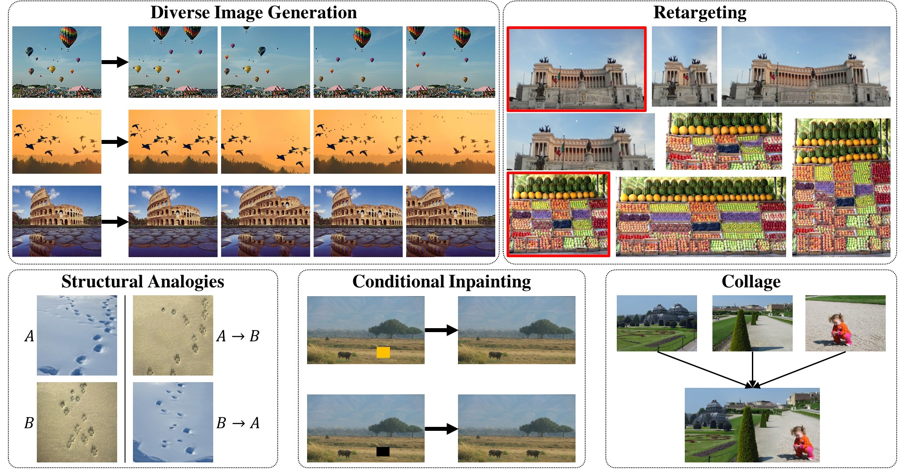

<h1 align="center"> Drop The GAN: <br /> In Defense of Patches Nearest Neighbors as Single Image Generative Models </h1>

<div align="center"><font size="+1"><em>Accepted to CVPR 2022 (oral)</em></font></div>

<div align="center">Niv Granot &ensp; Ben Feinstein &ensp; Assaf Shocher &ensp; Shai Bagon &ensp; Michal Irani</div>
<br/>

This is the official repository for "Drop The GAN: In Defense of Patches Nearest Neighbors as Single Image Generative Models" ([paper](https://arxiv.org/abs/2103.15545), [project page](https://www.wisdom.weizmann.ac.il/~vision/gpnn/)). 
 


## Setup
Please create environment as follows:
```bash
conda create -f environment.yml
```

## Run
To run the code, please do as follows:
```bash
conda activate dropthegan
python main.py <application> [<options>]
```

For example:
```bash
python main.py generation \
  --input-path="data/generation/balloons.png" \
  --output-path="out/generation/balloons.png"
```

You can list the applications by running:
```bash
python main.py --help
```
and to list the options for a given application by:
```bash
python main.py <application> --help
```

### Parameters
* Consider tuning parameters such as pyramid depth, alpha (i.e., completeness level), and noise standard-deviation for optimal results[^1].
* By default, the first GPU in the machine will be used, unless there are no GPUs and then it will run on CPU. You can override this default by providing the `--device` flag (`cuda:X` for GPU #X, or `cpu` for CPU)[^2].


[^1]: A fixed set of parameters was used for the quantitative experiments in the paper.
[^2]: The runtime reported in the paper (2 seconds per generation) is for 250x180 images, running the generation application on a Tesla-V100 GPU.